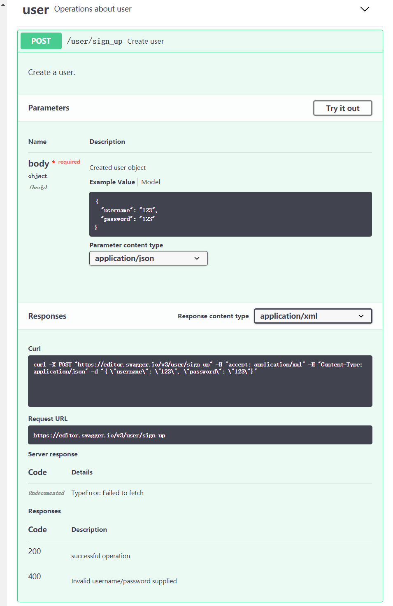
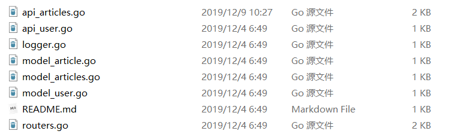
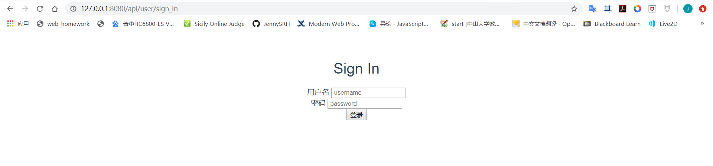
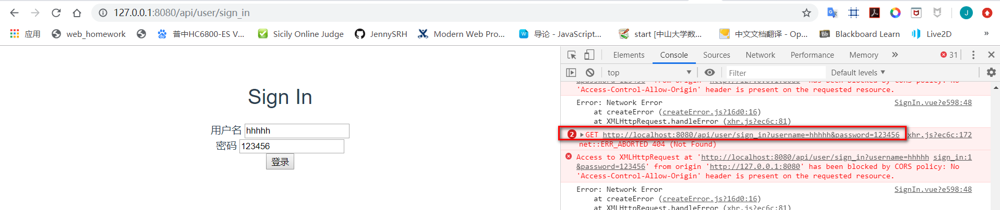

# 简单 web 服务与客户端开发实战

## API

### 资源类型

极简博客包括的资源有：`user, articles, reviews, tags`

### API服务列表

| API                 | 描述                                 |
| :------------------ | :----------------------------------- |
| SignUp              | 用户注册                             |
| SignIn              | 用户登录                             |
| GetArticlesByTag    | 通过文章标签获取文章内容以及文章评论 |
| GetArticlesByName   | 通过文章名字获取文章内容以及文章评论 |
| GetArticlesByAuthor | 获取某位作者的全部文章               |
| LogOut              | 用户退出                             |

------

#### SignUp

##### 功能

用户注册

##### 请求 URL

/v3/user/sign_up

##### 请求方法

POST

##### 请求参数

| 名称     | 类型   | 必填 | 说明     |
| :------- | :----- | :--- | :------- |
| name     | String | 是   | 用户名称 |
| password | String | 是   | 密码     |

##### 返回参数

| 名称    | 类型    | 说明    |
| :------ | :------ | :------ |
| Code    | Integer | code 码 |
| Message | String  | 信息    |

------

#### SignIn

##### 功能

用户登录

##### 请求 URL

/v3/user/sign_in

##### 请求方法

POST

##### 请求参数

| 名称     | 类型   | 必填 | 说明     |
| :------- | :----- | :--- | :------- |
| name     | String | 是   | 用户名称 |
| password | String | 是   | 密码     |

##### 返回参数

| 名称    | 类型    | 说明    |
| :------ | :------ | :------ |
| Code    | Integer | code 码 |
| Message | String  | 信息    |

------

#### GetArticlesByTag

##### 功能

获取文章列表

##### 请求 URL

/v3/articles/articles_by_tag

##### 请求方法

GET

##### 请求参数

| 名称     | 类型    | 必填 | 说明       |
| :------- | :------ | :--- | :--------- |
| tag      | String  | 是   | 文章标签   |
| pageSize | Integer | 是   | 分页大小   |
| pageNum  | Integer | 是   | 查询的页码 |

##### 返回参数

| 名称     | 类型           | 说明     |
| :------- | :------------- | :------- |
| Code     | Integer        | code 码  |
| Message  | String         | 信息     |
| Articles | List\<String\> | 返回文章 |

------

#### GetArticlesByName

##### 功能

获取文章列表

##### 请求 URL

/v3/articles/articles_by_name

##### 请求方法

GET

##### 请求参数

| 名称     | 类型    | 必填 | 说明       |
| :------- | :------ | :--- | :--------- |
| name     | String  | 是   | 文章标题   |
| pageSize | Integer | 是   | 分页大小   |
| pageNum  | Integer | 是   | 查询的页码 |

##### 返回参数

| 名称     | 类型           | 说明     |
| :------- | :------------- | :------- |
| Code     | Integer        | code 码  |
| Message  | String         | 信息     |
| Articles | List\<String\> | 返回文章 |

------

#### GetArticlesByAuthor

##### 功能

获取文章列表

##### 请求 URL

/v3/articles/articles_by_author

##### 请求方法

GET

##### 请求参数

| 名称     | 类型    | 必填 | 说明       |
| :------- | :------ | :--- | :--------- |
| name     | String  | 是   | 用户名称   |
| pageSize | Integer | 是   | 分页大小   |
| pageNum  | Integer | 是   | 查询的页码 |

##### 返回参数

| 名称     | 类型           | 说明     |
| :------- | :------------- | :------- |
| Code     | Integer        | code 码  |
| Message  | String         | 信息     |
| Articles | List\<String\> | 返回文章 |

------

#### LogOut

##### 功能

删除用户

##### 请求 URL

/v3/user/logout

##### 请求方法

GET

##### 请求参数

无

##### 返回参数

| 名称    | 类型    | 说明    |
| :------ | :------ | :------ |
| Code    | Integer | code 码 |
| Message | String  | 信息    |


### 使用Swagger编写API并测试

以用户注册为例，使用Swagger编写API。用户注册采用POST方法，schema为`#/definitions/User`

```yaml
  User:
    type: "object"
    properties:
      username:
        type: "string"
      password:
        type: "string"
    xml:
      name: "User"
```


```yaml
  /user/sign_up:
    post:
      tags:
      - "user"
      summary: "Create user"
      description: "Create a user."
      operationId: "signUp"
      produces:
      - "application/xml"
      - "application/json"
      parameters:
      - in: "body"
        name: "body"
        description: "Created user object"
        required: true
        schema:
          $ref: "#/definitions/User"
        x-exportParamName: "Body"
      responses:
        "200":
          description: "successful operation"
        "400":
          description: "Invalid username/password supplied"
```

使用swagger进行参数测试。




### 生成服务端

可以利用swagger网站生成`go-server`，其中在`go`文件夹下，帮我们实现了相关的路由和函数匹配。



我们只需要修改`api_articles`和`api_user`中的匹配函数来响应客户端的请求。

```go
package swagger

import (
	"net/http"
)

func GetArticlesByAuthor(w http.ResponseWriter, r *http.Request) {
	w.Header().Set("Content-Type", "application/json; charset=UTF-8")
	w.WriteHeader(http.StatusOK)
}

func GetArticlesByName(w http.ResponseWriter, r *http.Request) {
	w.Header().Set("Content-Type", "application/json; charset=UTF-8")
	w.WriteHeader(http.StatusOK)
}

func GetArticlesByTag(w http.ResponseWriter, r *http.Request) {
	w.Header().Set("Content-Type", "application/json; charset=UTF-8")
	w.WriteHeader(http.StatusOK)
}
```


### 生成客户端

这次我们使用Vue框架来进行客户端的开发。利用github的开源项目<https://github.com/chenweiqun/swagger-vue> 生成`api-vue.js`文件。

利用NodeJS生成`api-vue.js`文件。

```javascript
const swaggerGen = require('swagger-vue')
const jsonData = require('../api-docs.json')
const fs = require('fs')
const path = require('path')

let opt = {
  swagger: jsonData,
  moduleName: 'api',
  className: 'api'
}
const codeResult = swaggerGen(opt)
fs.writeFileSync(path.join(__dirname, '../dist/api-vue.js'), codeResult)
```

然后在client里的项目的`main.js`中添加

```javascript
import { setDomain } from './api-vue.js'
setDomain('http://localhost:8080/api')
```

然后在client项目里的components文件目录下修改各个component，根据`api-client.js`使用API函数。

以client项目中的`SiginIn.vue` 为例。

```vue
<template>
    <div class="signin">
        <h1> Sign In</h1>
        <form @submit="onSubmit">
            <div> 用户名  
            <input v-model="form.username" placeholder=" username">
            </div>
            <div> 密码
            <input v-model="form.password" placeholder=" password">
            </div>
            <button type="submit">
            登录    
            </button>
        </form>
    </div>
</template>

<script>

import {signIn} from '../api-vue.js'

export default {
    name: 'signin',
    data () {
        return {
        form: {
            username: '',
            password: ''
        },
        errorMessage: '',
        showErrorAlert: false,
        dismissSecs: 3,
        dismissCountDown: 0
        }
    },
    methods: {
        onSubmit(evt) {
            evt.preventDefault()
            let me = this
            signIn({
                username: me.form.username,
                password: me.form.password
            }).then(function (response) {
                console.log(response.data)
            }).catch(function (err) {
                console.log(err)
            })
        }
    }

}
</script>
```


## Client实现

利用github的项目生成`vue-api.js`。

修改`main.js`

```javascript
// The Vue build version to load with the `import` command
// (runtime-only or standalone) has been set in webpack.base.conf with an alias.
import Vue from 'vue'
import App from './App'
import router from './router'
import { setDomain } from './api-vue.js'
setDomain('http://localhost:8080/api')

Vue.config.productionTip = false

/* eslint-disable no-new */
new Vue({
  el: '#app',
  router,
  components: { App },
  template: '<App/>'
})

```

以`SignIn`为例，在component目录下增加`SignIn.vue`。完成前后端代码。

```vue
<template>
    <div class="signin">
        <h1> Sign In</h1>
        <form @submit="onSubmit">
            <div> 用户名  
            <input v-model="form.username" placeholder=" username">
            </div>
            <div> 密码
            <input v-model="form.password" placeholder=" password">
            </div>
            <button type="submit">
            登录    
            </button>
        </form>
    </div>
</template>

<script>

import {signIn} from '../api-vue.js'


export default {
    name: 'signin',
    data () {
        return {
        form: {
            username: '',
            password: ''
        },
        errorMessage: '',
        showErrorAlert: false,
        dismissSecs: 3,
        dismissCountDown: 0
        }
    },
    methods: {
        onSubmit(evt) {
            evt.preventDefault()
            let me = this
            signIn({
                username: me.form.username,
                password: me.form.password
            }).then(function (response) {
                console.log(response.data)
            }).catch(function (err) {
                console.log(err)
            })
        }
    }

}
</script>

<!-- Add "scoped" attribute to limit CSS to this component only -->
<style scoped>
h1, h2 {
  font-weight: normal;
}
ul {
  list-style-type: none;
  padding: 0;
}
li {
  display: inline-block;
  margin: 0 10px;
}
a {
  color: #42b983;
}
</style>

```

修改`index.js`，增加相应的路由。

```javascript
import Vue from 'vue'
import VueRouter from 'vue-router'
import HelloWorld from '@/components/HelloWorld'
import SignIn from '@/components/SignIn'
import SignUp from '@/components/SignUp'
import GetArticleByName from '@/components/GetArticleByName'

Vue.use(VueRouter)

const routes = [
  {
    path: '/api/user/sign_in',
    name: 'signin',
    component: SignIn
  }
]

export default new VueRouter({
  mode: 'history',
  routes
})

```

然后进行本地测试，打开`localhost:8080/api/user/sign_in`



点击登录按钮，查看客户端发送的请求。

